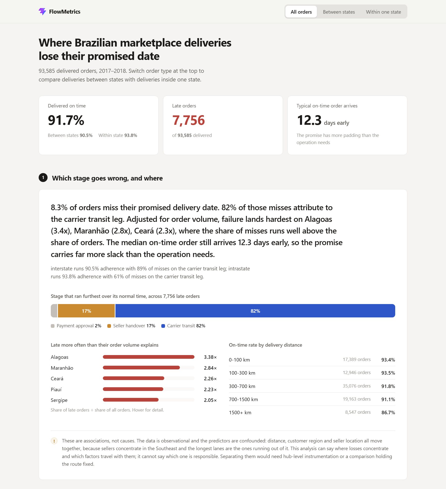
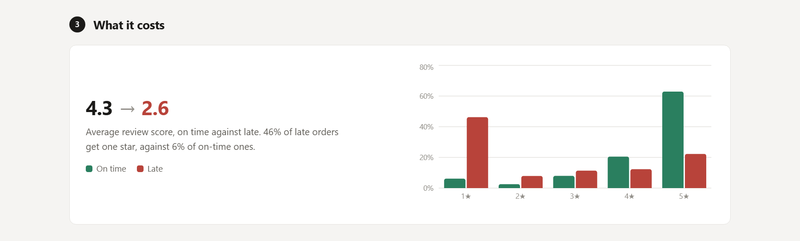
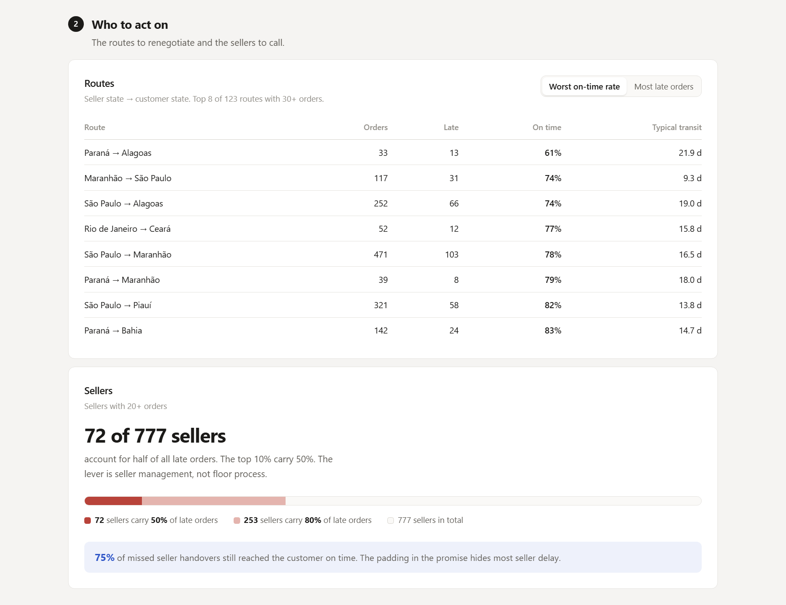

# FlowMetrics

**Which stage of a delivery loses the promised date, where those losses
concentrate, and what travels with them.**

A delivery manager sees orders missing their dates and needs to know which part
of the journey to fix, and whether it is theirs to fix at all. FlowMetrics
answers that over 93,585 real Brazilian marketplace orders. It splits each
delivery into its recorded stages, blames each late order on the stage that ran
furthest over its own normal time, and then narrows from stage to geography to
the factors that travel with failure.

**Data:** [Brazilian E-Commerce Public Dataset by Olist](https://www.kaggle.com/datasets/olistbr/brazilian-ecommerce),
published on Kaggle by Olist Store under CC BY-NC-SA 4.0. It holds about 100,000
real, anonymised orders from 2016 to 2018. It records two deadlines most datasets
lack: the delivery date promised to the customer at purchase, and the date by
which the seller must hand the parcel to the carrier.



---

## Running it

Requires Python 3.12+ and Node 20+.

```bash
pip install -r requirements.txt
cd frontend && npm install && npm run build && cd ..
python -m uvicorn api.main:app --port 8000
```

Open <http://127.0.0.1:8000>. One process serves both the dashboard and the API.
The cleaned table is committed, so this works from a fresh clone without a
Kaggle account.

```bash
python -m pytest tests/
```

27 tests pass on a fresh clone. The 28th rebuilds the table from the raw CSVs,
so it skips unless they are present. To rebuild from source, download the CSVs
from Kaggle into `data/raw/` and run `python -m data.clean`.

---

## Key findings

Every figure here is produced by code in this repository and regenerates on each
run. Nothing is typed into a template.

### 1. The promise is padded by nearly two weeks

**91.7% of orders arrive on time, and the median on-time order arrives 12.3 days
early.** Even the tenth percentile arrives 4.9 days early.

The operation is not fast. The promise is slow. The on-time rate is bought with
an estimate so cautious that most customers get their parcel well over a week
before the date they were given. Tightening that estimate is a planning decision
and needs no change on the floor.

### 2. The padding hides most seller failure

**9.1% of orders miss the seller's handover deadline, yet 75% of those still
reach the customer on time.** A seller can be late without the customer ever
knowing. Anyone who tracks only the customer-facing number cannot see this.

### 3. Which stage fails depends on the kind of order

Across all late orders, **82% are blamed on carrier transit.** That figure
splits sharply by order type:

| | On time | Carrier transit | Seller handover | Payment approval |
|---|---|---|---|---|
| Between states | 90.5% | 89% | 10% | 0.4% |
| Within one state | 93.8% | 61% | **33%** | 6% |

On a long route, a slow handover disappears into the transit time. When the
order stays inside one state, nothing absorbs the delay, and the seller accounts
for a third of failures. That is why every rate in this project is reported for
each order type separately.

### 4. Failure is heaviest where volume is lightest

São Paulo holds 42% of all orders, so "most late orders are in São Paulo" would
be true however well it performed. The useful comparison is each area's share of
late orders against its share of all orders. **The Northeast takes 2.05× the late
orders its volume would predict.** The North takes 1.39×, and the Southeast 0.85×.
The worst states are Alagoas (3.4×), Maranhão (2.8×) and Ceará (2.3×).

### 5. A late order costs 1.75 review points

**The average review score falls from 4.32 to 2.56 when an order misses its
date.** This is the link between the operational number and the business.



### 6. 72 sellers hold half the late orders

Of 777 sellers with at least 20 orders, **72 account for half of all late
orders**, and the worst 10% account for 50%. This is a seller-management problem,
not a floor-process one.



---

## Method

**Three stages, from four timestamps:** payment approval (purchase to approval),
seller handover (approval to carrier pickup), and carrier transit (pickup to
delivery).

**Late orders are blamed on the stage that ran furthest over its normal time, not
the longest stage.** Between states, carrier transit has a median of 208 hours
against 43 for seller handover. Blaming the longest stage would blame the carrier
every time, and the seller would never appear. Instead, each stage is compared
with its own typical duration, which separates slow by nature from slow on this
order.

**Normal is set per stage and per order type, from on-time orders only.** Transit
within one state has a median of 81 hours, against 209 between states, so the two
are different operations. Pooling them would make every in-state order look fast.
Including late orders would let the failures distort the baseline they are
measured against.

**Rankings carry minimum volumes:** 30 orders for a route, 20 for a seller and
200 for a product category. Without these floors, a route with three orders and
two failures would top every list.

---

## These are associations, not causes

The data is observational and its predictors are confounded. Distance, customer
region and seller location move together, because sellers cluster in the
Southeast and the longest routes run out of it. On-time delivery falls from 93.4%
under 100 km to 86.7% beyond 1,500 km. Nothing here can tell whether that gap
comes from distance, infrastructure or seller location.

The analysis can say where losses concentrate and which factors travel with
them. It cannot say which factor is responsible. Separating them would need
hub-level tracking data or a comparison that holds the route fixed. The dashboard
shows this caveat beside the findings, not in a footnote.

---

## What was excluded

94.1% of raw orders reach the analysis. Each rule counts what it removes, and the
dashboard footer shows the counts.

| Rule | Orders removed | Why |
|---|---|---|
| Not delivered | 2,963 | No delivery date, so no deadline can be judged |
| More than one seller | 1,272 | One handover time cannot be split between sellers |
| Impossible timestamps | 1,317 | A stage ending before it started: a recording error |
| Outside Jan 2017 to Aug 2018 | 267 | 2016 is too sparse and would make early volume look like a collapse |
| Missing a timestamp | 23 | An unknown stage length, not a zero one |
| Over 180 days end to end | 14 | Not physically plausible |
| **Remaining** | **93,585 of 99,441** | |

Impossible timestamps are dropped, not set to zero. A zero-length stage would
look like the fastest part of the network. A further 470 orders lack a distance
because a postcode is missing from the location table. They are kept, since
distance is one factor tested, not a requirement.

---

## Limitations

- **Carrier transit is a black box.** No intermediate scans exist, so line haul,
  sorting and last-mile delivery are one measurement. The largest source of delay
  is the one this data can say least about.
- **One stage per late order.** In reality, delays can build up across several
  stages.
- **Brazilian data.** The marketplace structure and the regional delivery
  gradient carry over to India. Cash-on-delivery returns, festive-season peaks
  and quick commerce do not appear at all.
- **2017 to 2018.** The data predates the pandemic, which reshaped e-commerce
  logistics.
- **Single-seller orders only.** The seller findings cover that subset.
- **No delivery attempts, returns, staffing or facility capacity.** Each order
  has one delivery timestamp and nothing else.
- **Straight-line distance** between postcode centres, which understates every
  route. It is good enough to test whether delay rises with distance, but it is
  not a routing figure.

---

## What I would do next

1. **Tighten the delivery estimate.** The median slack is 12 days, and closing it
   needs no operational change.
2. **Work the 72 sellers.** Half of all late orders sit with about 9% of sellers,
   upstream of anything the floor controls.
3. **Track carrier transit by stage.** Splitting it into line haul, sorting and
   last mile would give the biggest source of delay an owner.

Route and hub optimisation would follow. They are future work and are not built
here.

---

<details>
<summary>Repository layout</summary>

```
config.py            every rule that shapes the population
data/clean.py        joins the Olist tables, derives stages and deadlines,
                     applies and counts each exclusion
analysis/            every metric, defined once: kpis, lanes, rca
api/main.py          read-only JSON endpoints; computes nothing
frontend/src/        the React dashboard
tests/               cleaning and analysis invariants
```

</details>

Data © Olist, published on Kaggle under CC BY-NC-SA 4.0. The raw files are not
committed. Code is Apache 2.0.
